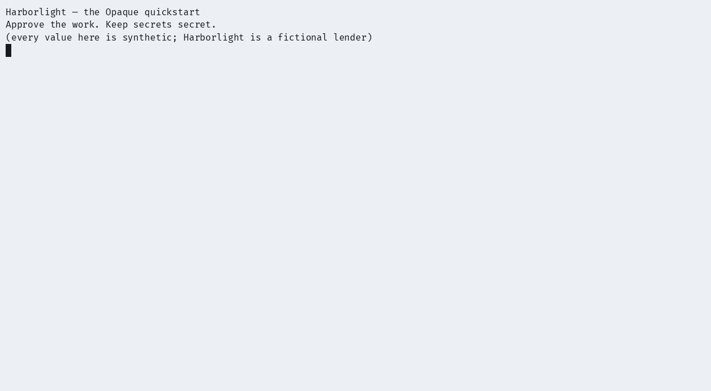

# Harborlight


[](LICENSE)

**Approve the work. Keep secrets secret.**

The [Opaque](https://github.com/opaque-dev/opaque) quickstart. Opaque is
not another secrets manager or agent framework. It decides what may pass
between the two you already have, and proves what did.

<picture>
  <source media="(prefers-color-scheme: dark)" srcset="assets/demo-dark.gif">
  
</picture>

Harborlight, Northstar and Cedar are fictional organizations. Every metric,
token and record in this repository is synthetic and labeled as such. This is
a worked example, and the credit union is a narrative device.

## The story

You work with a coding agent at Harborlight Credit Union, a fictional lender.
The agent's job is small and real: report the **manual review rate** from two
hours of seeded synthetic loan-application history. In fifteen minutes you
will watch the agent leak a token, put a policy between the agent and the
world, approve one operation with your fingerprint, and hold a tamper-evident
receipt for all of it.

| Act | What happens | Needs |
|---|---|---|
| 1 — The leak | The agent runs the way agents run today. The token leaks. | nothing |
| 2 — The policy | One readable file answers allow and deny. | `opaque` installed |
| 3 — The approval | The daemon gates the work. The sandbox gets the token by reference. | a daemon and one approval |
| 4 — The receipt | A real denial, a verified chain, one tampered row. | the same daemon |
| 5 — The mandate | A reviewed manifest, a one-shot allowance, replay denied, revoke. | a real Vault, or `--mock` |

Run everything at once with `./quickstart.sh`, or paste the acts below one
command at a time. The scripts create a throwaway `HOME` and never touch your
real `~/.opaque` state.

## Install

macOS and Linux. The acts need the released package, nothing from source:

```sh
brew install opaque-dev/tap/opaque
```

or

```sh
curl -sSfL https://raw.githubusercontent.com/opaque-dev/opaque/main/install.sh | sh
```

[](https://codespaces.new/opaque-dev/harborlight)

No local install needed: a codespace comes with Opaque preinstalled. Run
`./quickstart.sh --ci` there — a codespace has no biometric approver, so
approvals are synthetic and attributed in the audit record.

Native approvals use Touch ID on macOS and polkit on a Linux desktop. On a
headless machine, use [CI mode](#ci-mode) and read its caveat first.

## Act 1 — The leak

No Opaque yet. This is the way agents get credentials today: exported into
their environment.

```sh
./quickstart.sh --act 1
```

The dummy token (`demo_value_123456` — never replace it with a real secret)
goes into the environment, and the analyst does its job:

```text
Harborlight portfolio report (synthetic data)
  as of 2026-09-15T13:59:46Z (data time)
  source token: present (value withheld)

last 15 minutes:
  all channels: manual review rate 6.67 %, 5 reviews from 75 applications
  web: manual review rate 5.88 %, 3 reviews from 51 applications
  mobile: manual review rate 8.33 %, 2 reviews from 24 applications
  partner: unavailable (0 samples)

last 60 minutes:
  all channels: manual review rate 7.60 %, 25 reviews from 329 applications
  web: manual review rate 4.92 %, 9 reviews from 183 applications
  mobile: manual review rate 7.41 %, 8 reviews from 108 applications
  partner: manual review rate 21.05 %, 8 reviews from 38 applications

Unavailable is different from zero.
Keep count and rate questions distinct: the channel with the most reviews
may differ from the channel with the highest review rate.
```

Then the agent does what agents do. It dumps its environment "for debugging":

```text
$ python3 agent/analyst.py debug-env | grep HARBORLIGHT
  HARBORLIGHT_SOURCE_TOKEN=demo_value_123456
```

And a helper passes a secret-shaped string in its argv, where `ps` and shell
history can read it:

```text
$ ps -p <pid> -o args=
sh -c sleep 3; : password=dummy_value_123456
```

The token reached the transcript and the process table. Nothing decided
whether this read was allowed, and nothing recorded that it happened. The
general rule holds anywhere a process can print: anything in its environment
or its argv can end up in a transcript, a log, or a process listing.

## Act 2 — The policy

Opaque installed, still no daemon. Give this terminal a throwaway `HOME` so
your real `~/.opaque` stays untouched, then initialize it with a preset you
can read:

```sh
export HOME="$(mktemp -d /tmp/harborlight.XXXXXX)"
export XDG_RUNTIME_DIR="$HOME/xdg" && mkdir -p "$XDG_RUNTIME_DIR"
opaque init --preset github-secrets
```

The preset allows a handful of GitHub secret operations plus `test.noop`, and
denies everything else by default. The act script then makes two edits to the
generated `config.toml`. It prepends one top-level key above the preset's
rule tables:

```toml
data_dir = "<the throwaway HOME>/.opaque"
```

`data_dir` pins the daemon's state to this environment and scopes config-seal
verification to it. Without it the daemon consults the OS keychain, and a
machine that already runs a sealed Opaque installation would refuse this
throwaway config at startup. Top-level keys go at the top: a key appended
after a `[[rules]]` table would silently belong to that table.

Then it appends one rule for the analyst sandbox —
[read it](policy/harborlight-extras.toml), it is ten lines — and checks the
result:

```sh
cat policy/harborlight-extras.toml >> "$HOME/.opaque/config.toml"
opaque policy check   # ✔ policy OK: 8 rules loaded
```

Now ask the policy two questions:

```sh
opaque policy simulate --operation test.noop --client-type agent
opaque policy simulate --operation gitlab.set_ci_variable --client-type agent
```

```text
Policy Simulation
  operation: test.noop
  client: agent

✔  ALLOW (rule: allow-test-noop)
  approval: firstuse
  factors: LocalBio
  lease: 300s
```

```text
Policy Simulation
  operation: gitlab.set_ci_variable
  client: agent

✖  DENY: no matching policy rule (default deny)
```

The ALLOW names its rule and the approval it will demand — that is the
fingerprint prompt you are about to meet. Simulation is a dry run of the
policy file. The daemon can hold an operation to a stricter approval than the
rule states; it never holds one to a looser one.

## Act 3 — The approval

Start the broker in a second terminal and leave it running. Export the same
throwaway `HOME` and `XDG_RUNTIME_DIR` there first: the daemon and the CLI
find each other through them. The dummy source
value rides in the daemon's environment only — the analyst profile maps it in
by reference, and your first terminal never carries it:

```sh
# demo_value_123456 is a dummy value. Do NOT replace it with a real secret.
OPAQUE_DEMO_VALUE_SRC="demo_value_123456" RUST_LOG=info opaqued
```

A successful ping confirms connectivity. Read startup errors before
proceeding; ordinary session-mode startup does not establish separate
credential custody.

```sh
opaque ping      # ✔ Pong
opaque whoami
```

`whoami` reports `client_type: agent` even for you. Client classification is
audit-only: an agent drives the same signed CLI a human does, so it cannot be
a security boundary. Now run the gated operation:

```sh
opaque execute test.noop   # Touch ID / polkit prompt, then a 300 second lease
opaque leases              # the lease is visible state
opaque execute test.noop   # rides the lease, no prompt
```

Then the analyst again — inside the sandbox this time:

```sh
ANALYST_PYTHON="$(xcrun --find python3)"   # macOS: a concrete interpreter; the /usr/bin shim cannot run sandboxed
opaque exec --profile analyst -- "$ANALYST_PYTHON" agent/analyst.py report
```

```text
  output withheld (stdout: 856 bytes, stderr: 0 bytes)
✔  Sandbox exec succeeded (141ms)
```

Read that result closely, because both halves of it are the product working.
The report ran: without `HARBORLIGHT_SOURCE_TOKEN` the analyst exits
non-zero, and this shell never carried the value — the daemon injected it
from the profile's reference. And the content is withheld: this CLI is
classified as an agent, and an agent gets exit code and byte lengths, not the
856 bytes. The daemon classifies `sandbox.exec` as sensitive output — an
approval on every call, no lease. On Linux, skip the `xcrun` line and use
`python3` directly.

One Linux honesty note. Opaque 0.4.0 applies its Landlock and seccomp
restrictions to the sandbox wrapper itself, and the wrapper then cannot
finish its own setup: every platform-sandboxed exec fails on a
Landlock-capable kernel. We reported it upstream. Until the fix ships,
the scripts set `sandbox = false` on Linux; the broker path you just
watched — policy, approval, injection by reference, withheld output,
the audit record — is unchanged. macOS runs the real seatbelt sandbox.

One more callback. The careless argv from Act 1 is a habit the broker's own
records used to have:

```text
$ sqlite3 "$HOME/.opaque/audit.db" "select kind, detail from audit_events where kind='sandbox.created' order by rowid desc limit 1;"
sandbox.created|profile=analyst argument_count=3
```

An earlier Opaque persisted the full command line in this record; 0.4.0
records the argument count and keeps the argv out of its own database. The
principle survives the fix: audit metadata remains sensitive even when it
contains no secret values.

## Act 4 — The receipt

Ask for something the policy never allowed. The github-secrets preset has no
GitLab rule, so the broker refuses this before resolving any credential or
touching the network — no GitLab account, token, or project exists here:

```sh
opaque gitlab set-ci-variable \
  --project tutorial/denied \
  --key TUTORIAL_KEY \
  --value-ref keychain:opaque/tutorial-value
```

```text
✖  policy denied: operation 'gitlab.set_ci_variable' denied by policy — debug with: opaque policy simulate --operation gitlab.set_ci_variable
  code: policy_denied
```

The denial is real and it landed in the chain:

```sh
opaque audit tail --kind policy.denied --limit 5
opaque audit verify
```

```text
Audit log — 1 event(s)
  WHEN                              EVENT          OPERATION               OUTCOME   REQUEST ID
  --------------------------------  -------------  ----------------------  --------  ------------------------------------
  0s ago  2026-09-16T17:40:07.674Z  policy.denied  gitlab.set_ci_variable  [denied]  03a29297-a676-4e59-aeda-4514aebfe5ea

✔  Audit chain intact — 31 records verified
```

Now falsify it. Stop the daemon, edit one row, verify again:

```sh
sqlite3 "$HOME/.opaque/audit.db" \
  "update audit_events set detail='tampered' where rowid=(select max(rowid) from audit_events);"
opaque audit verify
```

```text
✖  Audit chain BROKEN — audit chain broken at record 31 (sequence 30) (30 records verified before the break)
```

`verify` exits non-zero and names where the chain broke.

Verification checks local audit integrity under its custody assumptions.
Someone holding the audit HMAC key can forge records; verification cannot
establish that a compromised broker reported truthfully. In the default
single-account install this chain is tamper-evident. Under
[enforced trust-domain custody](https://github.com/opaque-dev/opaque/blob/main/docs/compliance/hardening.md)
it hardens into a boundary the agent's account cannot cross.

## Act 5 — The mandate

Acts 1–4 governed one operation at a time. A **bounded task** governs a whole
job in advance: a reviewed manifest fixes the exact actions, an allowance, and
an expiry; approval binds to that manifest's digest; the broker charges the
allowance once and refuses a replay. This is "keep authority bounded" — the
agent is handed a mandate, not a standing key.

This act stands up a **real HashiCorp Vault** so the custody is real. The
featured path needs the `vault` binary:

```sh
brew install vault      # macOS; on Linux see developer.hashicorp.com/vault/install
```

Without it, the act falls back to a fully-mocked path (`--act 5` still runs, or
force it with `--mock`); the fallback shows the same ledger mechanics but cannot
make the real-custody claim. The GitHub Actions API is always a local mock —
only the destination effect is faked.

```sh
./quickstart.sh --act 5
```

The act starts a throwaway Vault dev server, puts a **dummy** secret into real
Vault KV v2, and enables bounded tasks in a task-scoped daemon:

```text
$ vault kv put secret/task-app TOKEN=bt-demo-secret-plaintext
The plaintext now lives in Vault. Your shell and the agent below never
carry it; the broker resolves the vault: reference and injects it.
```

The [manifest](mandate/manifest.json) authorizes exactly one write — publish
`TASK_SECRET` to a repository, its value pulled from that Vault reference:

```json
{ "schema_version": 1, "title": "Publish TASK_SECRET to acme/task-widgets",
  "expires_in_secs": 300,
  "actions": [ { "repo": "acme/task-widgets", "secret_name": "TASK_SECRET",
    "value_ref": "vault:secret/data/task-app?version=1#TOKEN",
    "github_token_ref": "env:BT_PAT" } ] }
```

Plan it. The broker resolves the repository to a stable id, pins the manifest to
a digest, and reserves the one-write allowance under your local identity — no
tenant, no hosted broker:

```sh
opaque task plan --manifest mandate/manifest.json
```

```text
Publish TASK_SECRET to acme/task-widgets
Task: aa5741e0-2ce7-4529-bda4-0e201c6e6e7c
State: planned | Charged: 0/1 writes
Digest: 98f79f27ab0ca30c6ce2d6e6a2f243ede323f3b1458520c02944c64c57d6164f
Expires: 1789628017 (Unix seconds)
GitHub: http://127.0.0.1:51181
Vault: http://127.0.0.1:51182
Approval: not granted

  acme/task-widgets / TASK_SECRET [repository 424242]
    Source: vault:secret/data/task-app?version=1#TOKEN
    Slot: aa5741e0-2ce7-4529-bda4-0e201c6e6e7c:01
    Outcome: not attempted
    Credential reference: env:BT_PAT

Review the exact scope above, then run: opaque task run aa5741e0-2ce7-4529-bda4-0e201c6e6e7c
```

The digest fixes the manifest; the repository resolves to id `424242`; the slot
is reserved but `Charged: 0/1` — nothing runs on a plan alone.

Run it once. Approval binds to the digest; the broker charges the slot before it
dispatches, then calls the provider:

```sh
opaque task run aa5741e0-2ce7-4529-bda4-0e201c6e6e7c
```

```text
Publish TASK_SECRET to acme/task-widgets
Task: aa5741e0-2ce7-4529-bda4-0e201c6e6e7c
State: completed | Charged: 1/1 writes
Digest: 98f79f27ab0ca30c6ce2d6e6a2f243ede323f3b1458520c02944c64c57d6164f
Expires: 1789628017 (Unix seconds)
GitHub: http://127.0.0.1:51181
Vault: http://127.0.0.1:51182
Approval: INSECURE TEST APPROVAL at 1789627718 (Unix seconds)

  acme/task-widgets / TASK_SECRET [repository 424242]
    Source: vault:secret/data/task-app?version=1#TOKEN
    Slot: aa5741e0-2ce7-4529-bda4-0e201c6e6e7c:01
    Outcome: API accepted
    Credential reference: env:BT_PAT
    Receipt code: api_accepted

GitHub accepted these writes; secret values cannot be read back for verification.
```

`Charged: 1/1` and `Outcome: API accepted`. Under `--ci` the approval is the
synthetic `INSECURE TEST APPROVAL`; run it without `--ci` and the same line
names the real approver behind your Touch ID.

Run it again. The allowance is spent, and a spent allowance is not restored by
retrying:

```text
✖  task has already been claimed; inspect its receipt instead of starting another run
  code: task_unavailable
(refused: the manifest authorized one write, and it was consumed.
A spent allowance is not restored by retrying.)
```

The receipt records what happened without exposing the value:

```sh
opaque task show aa5741e0-2ce7-4529-bda4-0e201c6e6e7c
```

```text
Publish TASK_SECRET to acme/task-widgets
Task: aa5741e0-2ce7-4529-bda4-0e201c6e6e7c
State: completed | Charged: 1/1 writes
Digest: 98f79f27ab0ca30c6ce2d6e6a2f243ede323f3b1458520c02944c64c57d6164f
Approval: INSECURE TEST APPROVAL at 1789627718 (Unix seconds)

  acme/task-widgets / TASK_SECRET [repository 424242]
    Source: vault:secret/data/task-app?version=1#TOKEN
    Outcome: API accepted
    Receipt code: api_accepted

GitHub accepted these writes; secret values cannot be read back for verification.
```

The receipt is the persisted record of the completed task — same digest, the
charge, the approver, and the outcome. It names the `vault:` reference, never
the value it resolved.

A mandate can also be pulled before it runs. Plan a second task, revoke it, and
watch the run refuse:

```sh
opaque task revoke <second-task-id>
opaque task run    <second-task-id>   # refused: task has been revoked
```

The plaintext never left Vault. Your shell set `value_ref`, not a value; the
broker resolved it and the agent received a receipt, not a secret. That custody
is the real claim of this act. What it does **not** prove is a real GitHub
effect — that API was a local mock. From the
[bounded-work guide](https://github.com/opaque-dev/opaque/blob/main/docs/bounded-work.md):

> Automated mock-provider and disposable fixtures validate mechanisms; they do
> not qualify a live repository's credentials, workflow protections, artifact,
> reviewer installation or business outcome. Qualify those controls for the
> selected deployment before treating a successful API response as evidence that
> the task achieved its goal.

## CI mode

```sh
./quickstart.sh --ci
```

CI mode adds `approval_backend = "insecure_auto_approve"` to the top of the
generated config, beside `data_dir`, and sets
`OPAQUE_INSECURE_AUTO_APPROVE=1`. The daemon then approves everything without
a human. It refuses to start with only half of that pair set, and it
announces the mode in its own audit chain:

```text
$ opaque audit tail --operation daemon_startup --limit 2

Audit log — 2 event(s)
  WHEN                              EVENT                 OPERATION       OUTCOME                    REQUEST ID
  --------------------------------  --------------------  --------------  -------------------------  ----------
  0s ago  2026-09-16T17:40:07.099Z  approval.granted      daemon_startup  [insecure_backend_active]  -
  0s ago  2026-09-16T17:40:07.093Z  trust_domain.posture  daemon_startup  [shared_uid]               -
```

Even the bypass leaves evidence. This mode exists for learning and CI; never
use it in production.

The [verify workflow](.github/workflows/verify.yml) runs the whole story
against the released package on Linux and macOS on every push and weekly,
and asserts the leak, the deny, the sandboxed run, the intact chain, the
tamper detection, the synthetic-approver attribution, and the bounded-task
allowance and revoke. If this README drifts from the product, the badge goes
red. CI runs Act 5 with `--mock` (no Vault install on the runner); the real
Vault path is the default when you run it locally.

## Graduate

The acts used no external accounts. The same broker, pointed at real work:

1. **A real GitHub secret.** `opaque github build-manifest` and
   `opaque github publish-manifest --dry-run` preview the flow with zero
   credentials. Then follow the
   [tutorial](https://github.com/opaque-dev/opaque/blob/main/docs/tutorial.md)
   with a disposable token and a test repository.
2. **Claude Code over MCP.** The full walkthrough:
   [Use Opaque with Claude Code](quickstarts/claude-code-github.md) — wire in
   [mcp/mcp.json.example](mcp/mcp.json.example), watch zero-credential tool
   calls, then publish a real GitHub secret the agent never sees.
3. **Wrap your agent.** `opaque agent run -- your-agent` starts the agent with
   a baseline environment: inherited API keys in your shell do not reach it.
   `--pass-env KEY` forwards exceptions deliberately.
4. **The hosted demo.** [demo.opaque.info](https://demo.opaque.info/) runs a
   bounded task against this same fictional customer: review it, approve it,
   run it once, then try again to see Opaque block the repeat.
5. **The evaluation guide.** For the person who signs off on what an agent may
   touch:
   [Falsify it in fifteen minutes](https://github.com/opaque-dev/opaque/blob/main/docs/evaluation-guide.md).

## What this shows, and what it does not

This is a local learning exercise: agent and daemon share your user account.
It does not isolate credentials from other processes with that account's
access. Use a throwaway value and test repository, not production credentials
or data. A separate directory under the same account is insufficient.

The agent is the adversary. Its model, its dependencies, its prompt context
and every command it emits are untrusted, including in the moments it is
being helpful. The broker, its administrators, the credential stores and
enrolled approval keys remain trusted. Opaque does not prevent an agent from
using credentials it can already read through another path.

Opaque holds no certifications today. From the
[evaluation guide](https://github.com/opaque-dev/opaque/blob/main/docs/evaluation-guide.md),
what Opaque does not do:

> - No SCIM or IdP group sync. Roles resolve inside the daemon.
> - No Slack or Teams approval routing. Approval is local native review or a
>   paired workstation.
> - No fleet dashboard across many daemons.
> - No SOC 2 report, no FedRAMP authorization.
> - No control over credentials the agent obtains outside the broker.
>
> If one of these is disqualifying, the trial below will not change that, and
> we would rather you know now.

## Repository layout

```text
quickstart.sh          the five acts in one run (--ci headless, --mock Act 5)
acts/                  each act, runnable on its own
agent/analyst.py       the toy agent: report | debug-env
data/                  synthetic loan-application history and its generator
profiles/analyst.toml  the sandbox profile (token injected by reference)
policy/                the one rule appended to the github-secrets preset
mandate/               Act 5: the bounded-task manifest and the mock GitHub API
mcp/mcp.json.example   hand-written MCP configuration for Claude Code
quickstarts/           platform guides: Claude Code with GitHub
assets/                the terminal recording and how it was made
.devcontainer/         Codespaces environment with Opaque preinstalled
```

`data/generate.py` is deterministic: the numbers in this README are the
numbers in the checked-in CSV, and CI regenerates the file to prove it.

## License

This quickstart is Apache-2.0. Opaque itself is
[BUSL-1.1](https://github.com/opaque-dev/opaque/blob/main/LICENSE),
free for teams of up to 10 developers.
